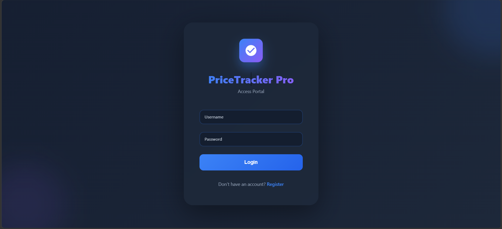
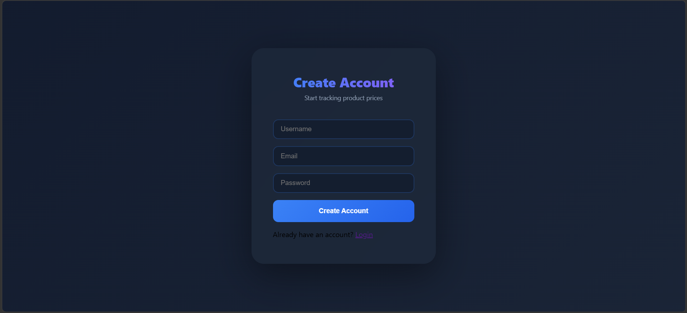
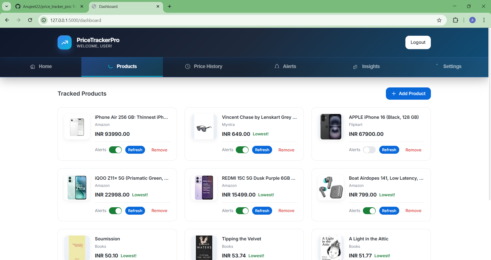
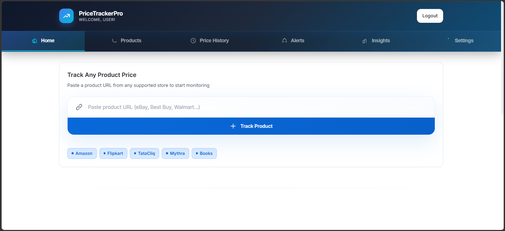
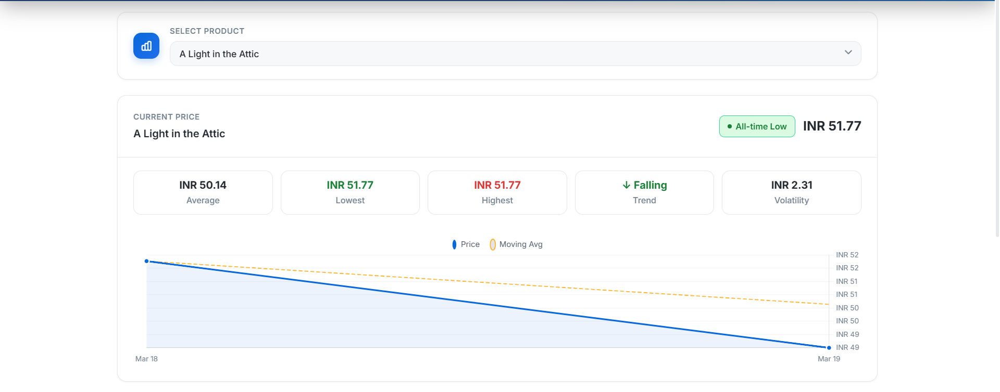
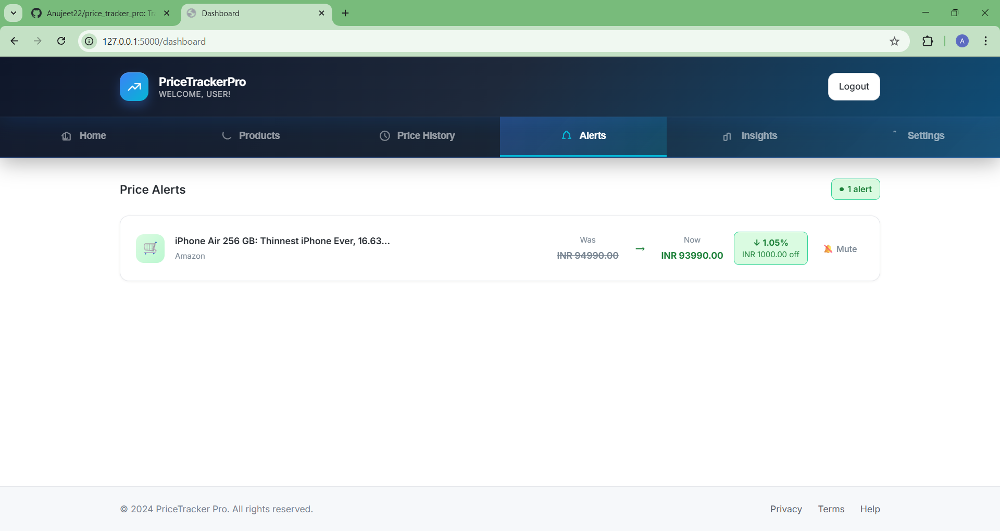
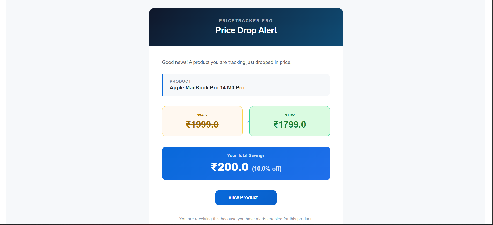
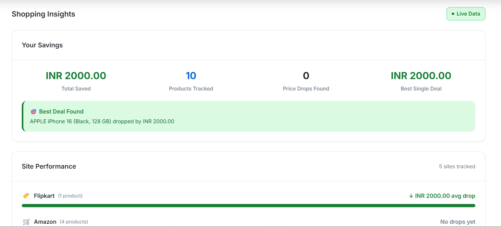

# 💰 PriceTracker Pro

A full-stack web application that monitors e-commerce product prices, tracks price history, detects price drops, and sends email alerts — built with Python, Flask, and PostgreSQL.

---

## 🚀 Features

- Add any product via URL — product name and price are extracted automatically  
- Dashboard shows all tracked products with current prices  
- Price history chart with moving average and trend analysis  
- Alerts tab shows all active price drops with percentage savings  
- Insights tab shows total savings, best deals, and site performance  
- Email notification sent when a price drops  

---

## 🧠 Overview

PriceTracker Pro allows users to monitor product prices across multiple e-commerce platforms in real time. By simply pasting a product URL, the application automatically extracts product details, tracks price changes over time, and notifies users when a price drop occurs.

---

## 📸 Application Preview

### 🔐 Authentication

#### Login Page


#### Register Page


---

### 🛒 Products


---

### 🖥️ Dashboard


---

### 📊 Price History


---

### 🚨 Alerts


---

### 📧 Email Alert


---

### 📈 Insights


---

## 🌐 Supported Sites

- Amazon India  
- Flipkart  
- TataCliq  
- Myntra  
- Books to Scrape (demo/testing)  

---

## 🔐 Authentication

- User registration and login with hashed passwords  
- Session management via Flask-Login  

---

## 📦 Product Tracking

- Scrapes product name, price, image, and availability on add  
- Stores price history on every check  
- Tracks lowest, highest, and average prices per product  

---

## 📊 Price History

- Interactive Chart.js chart per product  
- Moving average overlay (Pandas rolling window)  
- Trend detection using NumPy linear regression (rising / falling / stable)  
- Volatility score calculated from standard deviation  

---

## 🚨 Alerts

- Per-product alert toggle (on/off)  
- Alerts tab lists all products with active price drops  
- HTML email alert sent via Gmail SMTP  

---

## 📈 Insights

- Total savings across all tracked products  
- Best single deal detected  
- Site performance comparison with average price drop per site  

---

## 🧰 Tech Stack

- Python 3  
- Flask  
- PostgreSQL + SQLAlchemy ORM  
- Playwright (Amazon)  
- Camoufox + BeautifulSoup (Flipkart, TataCliq, Myntra)  
- Flask-Login, Werkzeug  
- Flask-Mail (Gmail SMTP)  
- Pandas, NumPy  
- Chart.js  
- Jinja2 templates, vanilla CSS  

---

## 📁 Project Structure

pricetracker/
├── app.py
├── models.py
├── scraper.py
├── config.py
├── database.py
│
├── utils/
│ └── mailer.py
│
├── templates/
│ ├── dash.html
│ ├── login.html
│ ├── register.html
│ ├── components/
│ └── sections/
│
└── static/
├── css/
└── js/

---

## ⚙️ Installation & Run

```bash
git clone https://github.com/Anujeet22/pricetracker-pro.git
cd pricetracker-pro

python -m venv venv
source venv/bin/activate    # Windows: venv\Scripts\activate

pip install -r requirements.txt
playwright install chromium

python app.py

---

## 🔍 How the Scraper Works

Each supported site has its own dedicated scraper in `scraper.py`. The site is detected from the URL domain. Amazon uses Playwright (headless Chromium) because it requires JavaScript rendering. Flipkart, TataCliq, and Myntra use Camoufox combined with BeautifulSoup. A random user-agent and polite delay are applied before every request.

---

## 📊 Data & Analytics

Once a product has at least 2 price records, the `/api/history/<id>` endpoint processes the data with Pandas and NumPy:

- Moving average — 3-point rolling mean  
- Percentage change — relative to the first recorded price  
- Trend — linear regression slope (rising / falling / stable)  
- Volatility — standard deviation of all recorded prices  

---

## 🔑 Environment Variables

- `SECRET_KEY` — Flask session secret  
- `DB_PASSWORD` — PostgreSQL password  
- `MAIL_USERNAME` — Gmail address  
- `MAIL_PASSWORD` — Gmail App Password  

---

## 📚 What I Learned Building This

- Scraping JavaScript-rendered pages with Playwright and handling anti-bot detection  
- Designing a relational schema for time-series price data  
- Using Pandas and NumPy inside a Flask API for lightweight analytics  
- Building a multi-tab dashboard with vanilla JS and Jinja2  
- Sending transactional HTML emails via Flask-Mail  

---

## 📌 Future Improvements

- Integrate APScheduler for automated background price checks (planned)  
- Per-product price drop threshold  
- Export price history to CSV  
- Support for more Indian e-commerce sites  
- Docker + deployment guide  

---

## 👨‍💻 Author

**Anujeet Kadam**  
MCA Student | AI & Tech Enthusiast  

- GitHub: https://github.com/Anujeet22  
- LinkedIn: https://linkedin.com/in/anujeetkadam  

---

## 📄 License

MIT  

---

## ⭐ Support

If you found this project useful, consider giving it a ⭐ on GitHub!